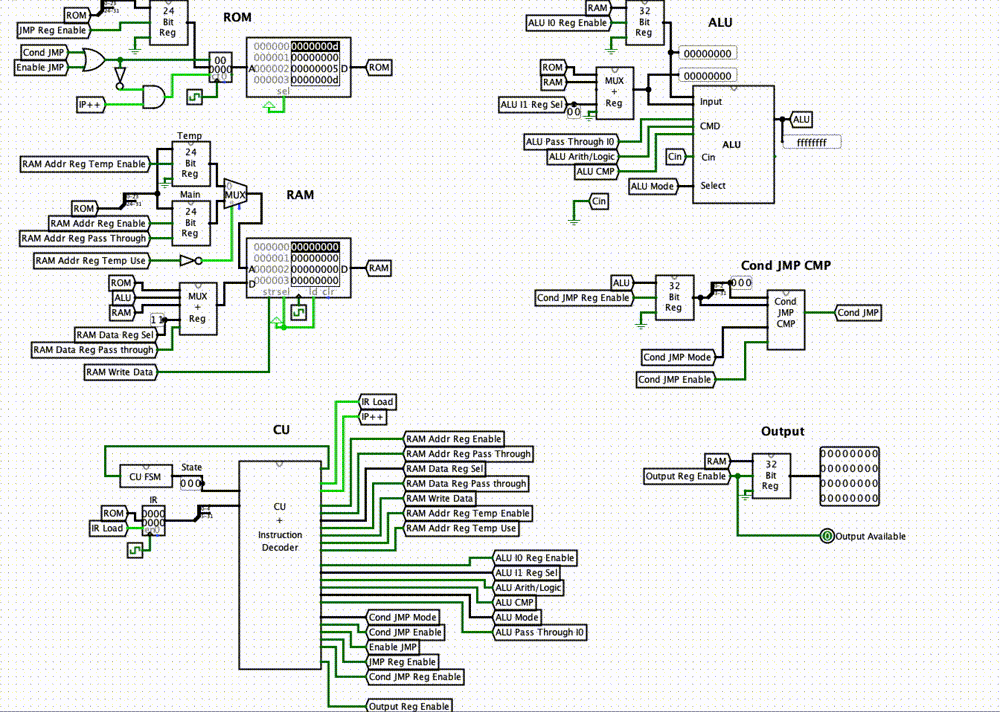

# Simple CPU

This Project is a simple 32 bit processor completely written in [Logisim](http://www.cburch.com/logisim/) from basic logic gates. It's accompanied by an assembler written in Swift.

I created this project while studying at [UAT](https://www.uat.edu) (2015) to gain an understanding of logic and CPUs.




## Usage

1. Write an assembly program, for example:

	```assembly
	; Calculate Fibonacci Numbers
	SECTION .data
	  Fnumber 5   ; number of numbers to produce
	  F1 0        ; Initial number 1
	  F2 1        ; Initial number 2
	  Result 1    ; Variable to store result
	
	SECTION .text
	  out F1
	  out F2
	loop:
	  add Result, F1
	  mov F1, F2
	  mov F2, Result
	  out Result
	  dec Fnumber
	  jnz loop
	```

2. Assemble: save the program into the `Resources` folder of the swift `Assembler.playground`. Run the playground. The assembled output will appear in the debug area which can now be saved as a file.
3. Load the machine code into the ROM in Logisim. Go to the `Processor` circuit. Right click on the `ROM` and select `Load Image…`. 
4. Select `Reset Simulation` and then `Ticks Enabled` from the menu bar.
5. Enjoy the results in the `main` circuit.


## Instruction set

This processor has 28 instruction. Including logic, arithmetic, compare, store, jump and output instructions. The instructions behave similar to x86 instructions. Most of the code written for this processor should (with tiny modifications) run on a “real” CPU.


Instruction | Number | Arguments | Description
--- | ---- | --- | ---
pass | 0 | _mem_ | Pass through
not | 1 | _mem_ | Bit-Wise Complement
or | 2 | _mem_, _mem_ | Bit-Wise OR
or | 3 | _mem_, _con_ | Bit-Wise OR
and | 4 | _mem_, _mem_ | Bit-Wise AND
and | 5 | _mem_, _con_ | Bit-Wise AND
add | 6 | _mem_, _mem_ | Add
add | 7 | _mem_, _con_ | Add
sub | 8 | _mem_, _mem_ | Subtract
sub | 9 | _mem_, _con_ | Subtract
cmp | 10 | _mem_, _mem_ | Compare
cmp | 11 | _mem_, _con_ | Compare
mov | 12 | _mem_, _mem_ | Store
mov | 13 | _mem_, _con_ | Store
jmp | 14 | _label_ | Jump to label
je | 15 | _label_ | Jump when equal
jne | 16 | _label_ | Jump when not equal
jg | 17 | _label_ | Jump when greater than
jge | 18 | _label_ | Jump when greater than or equal to
jl | 19 | _label_ | Jump when less than
jle | 20 | _label_ | Jump when less than or equal to
jz | 21 | _label_ | Jump when last result was zero
jnz | 22 | _label_ | Jump when last result was not zero
inc | 23 | _mem_ | Increment
dec | 24 | _mem_ | Decrement
xor | 25 | _mem_, _mem_ | XOR
xor | 26 | _mem_, _con_ | XOR
out | 27 |  | Output


